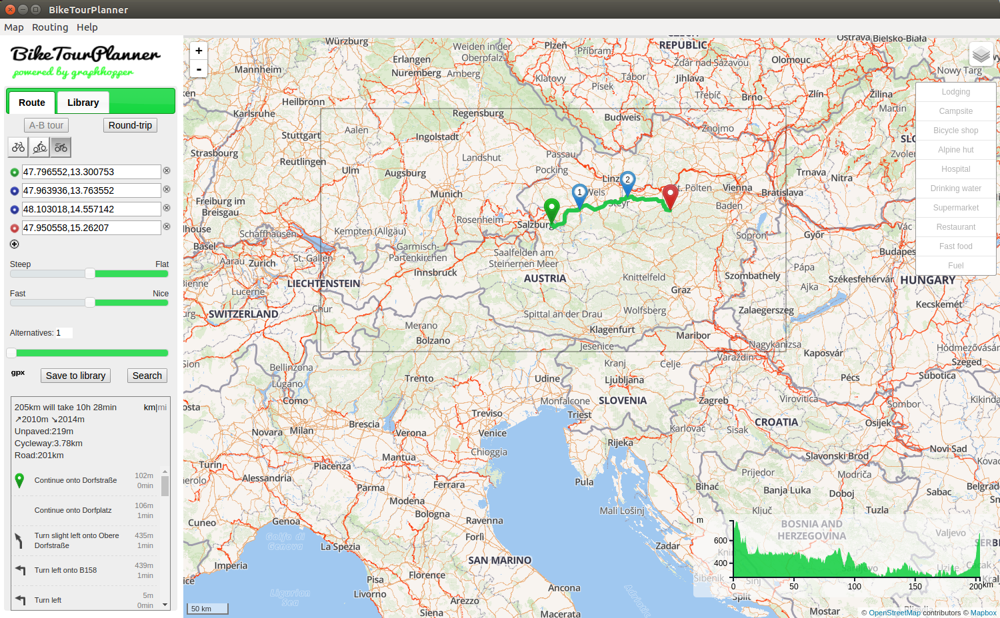

# BikeTourPlanner

BikeTourPlanner is an open source desktop application for offline planning of bicycle tours based on the [GraphHopper](https://github.com/graphhopper/graphhopper) routing engine. 
It allows the user to generate routing data from [OpenStreetMap](http://www.openstreetmap.org/about)(OSM) data on demand.

BikeTourPlanner is a [nwjs](http://nwjs.io/) application.
It uses offline maps which are provided by [OSM2VectorTiles](http://osm2vectortiles.org/about) and displayed using [Leaflet](https://github.com/mapbox/mapbox-gl-js) and [mapbox-gl-js](https://github.com/mapbox/mapbox-gl-js). 
BikeTourPlanner comes with an integrated local vector tile map server which uses [nodejs](https://nodejs.org/en/). 
BikeTourPlanner requires an installed Java 8 runtime.

The currently supported platforms are: 

* Linux 64-bit 
* Microsoft Windows 64-bit. 

Implementation of support for Mac OS X 64-bit should be possible with few changes.

The look and feel is similar to [GraphHopper Maps](https://graphhopper.com/maps) as most parts are identical. Here is a screen-shot of the main window:

BikeTourPlanner comes with the map and OSM data of Liechtenstein. 
The map features and the routing features are completely separated. 
This means changing a region requires the user to switch the map in one step and in a second step to seperatly switch the covered routing area. 
The reason is that the data comes from two separated sources.

## Map features
* Integrated download possibility for the installation of OSM2VectorTiles map extracts
* Rendering of OSM bicycle route relations in four different colors, which are derived from the OSM `network` tag. Unpaved way segments show up as a dotted line
* Display of bicycle specific point of interests, some with the possibility to show up OSM features
  Following point of interests are dynamically selectable: Logging, Campsites, Bicycle shops, Alpine huts, Hospitals, Drinking water, Supermarkets, Restaurants, Fast food, Fuel
* BikeTourPlanner comes with bicycle specific route rendering and POIs covering the Liechtenstein area to keep the package small.
  It is possible to replace two files with in order to extend the bicycle specific rendering to world wide coverage. 
  This download would be about 1.4GB. The two bigger replacement files are located at ??
* Display of elevation profile
* The usage of a map containing the whole planet is possible. Its size currently (Nov 2016) is about 56GB. Please do not try to download the whole planet via the menu, but rather use a web browser for downloading it.

## Routing features
* Routing profiles are switchable between bicycle types commuting, mountainbike and racebike
* OSM file download from [GeoFabric](http://download.geofabrik.de) can be started from the menu
* Calculation of routing data from *.pbf or *.osm OSM files. The duration for a calculation depends on the size of the OSM file and the covered area. Please note that calculation of the routing data is time consuming. 
* Routing data is locally cached. Switching between the covered routing regions is possible via the menu
* The region size which can be handled mainly depends on the RAM. 8 GB RAM should be sufficient to cover the whole DACH area (Germany, Switzerland, Austria). For a German Bundesland 4 GB RAM should be sufficient.
* Automatic download of elevation data during route data calculation. This data is cached locally. This process requires internet connectivity in case that the cache does not contain the region. The data might become pretty big.
* Route from A to B with optional stopover points
* Round-trips from a starting point with a targeted distance and optional heading
* Display of the distance spent on way classifications
* Display for unpaved segments as dashed line
* Display of guessed ascend. Please note that the calculated value might be quite inaccurate!
* Tuning between fast or nice routes
* Routing takes elevation data into account. Tuning between steep or flat routes is possible for all the three bicycle types
* Alternative routes calculation
* GPX export
* Storing of tours and possiblity to use a stored tour as template for a new one

## Other features
* The OSM files, the vector tiles, and calculated graph data reside under the data folder located relative to the intallation root folder such that its content can be kept for updates
* Searching OSM data by name and address via [Nominatim](http://wiki.openstreetmap.org/wiki/Nominatim) is possible, but requires internet connectivity.

## Limitations
* Currently switching between routing areas on Windows may freeze the application for a short period. On Linux this works fine

## Bugs
Report bugs on [https://github.com/ratrun/biketourplanner](https://github.com/ratrun/biketourplanner/issues)

### Some heading

